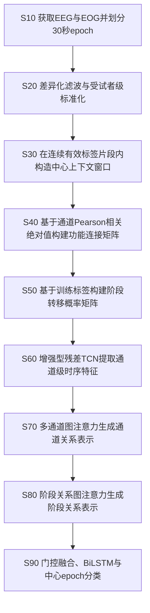
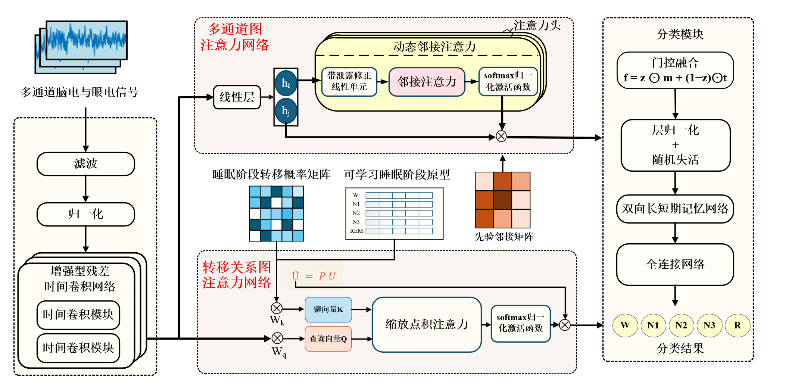
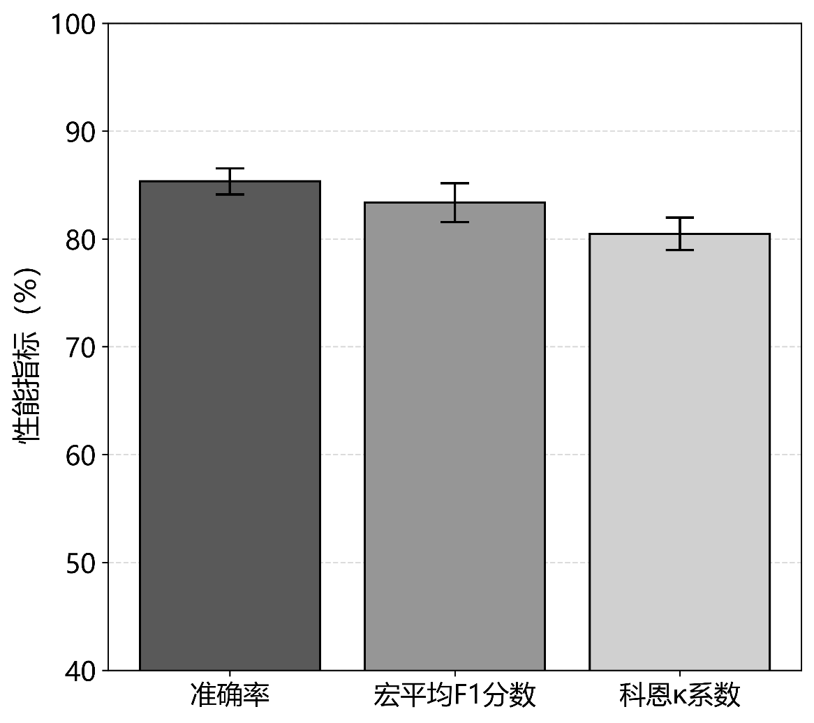
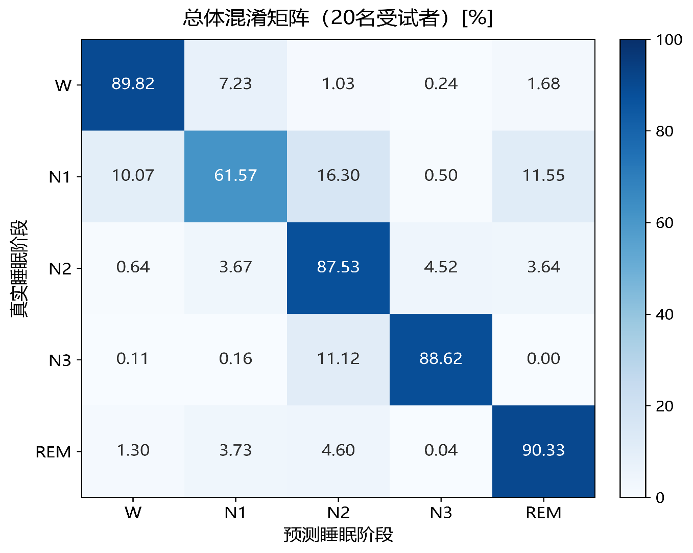
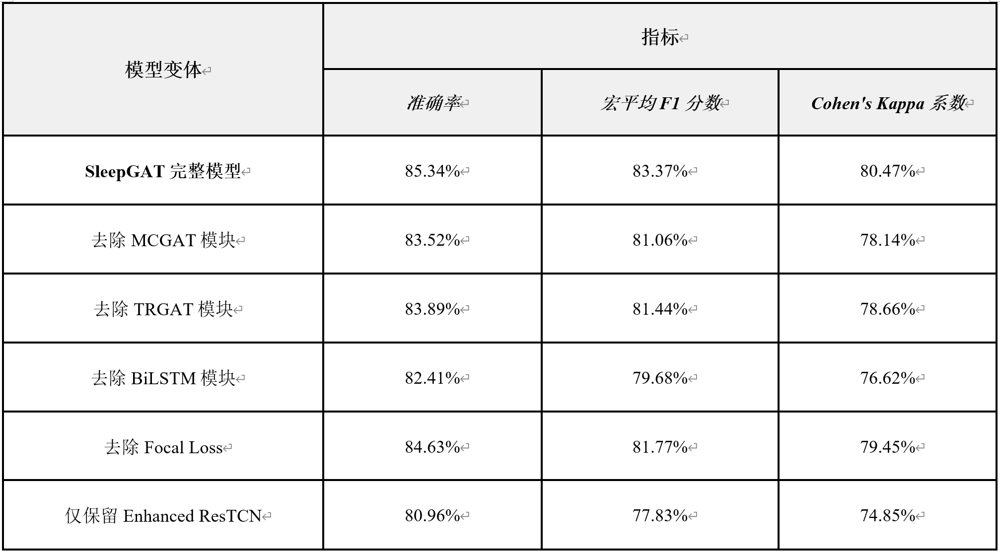
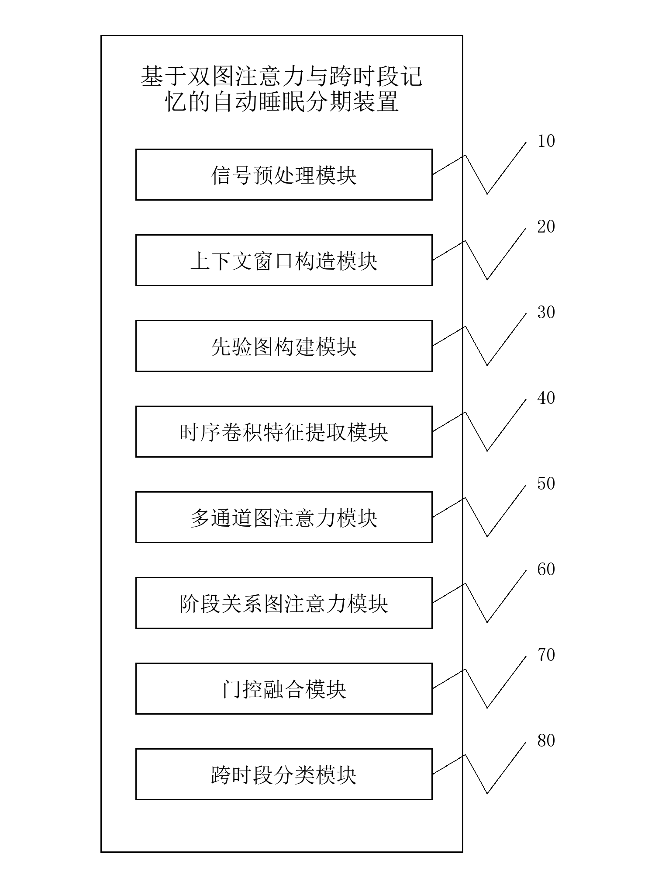
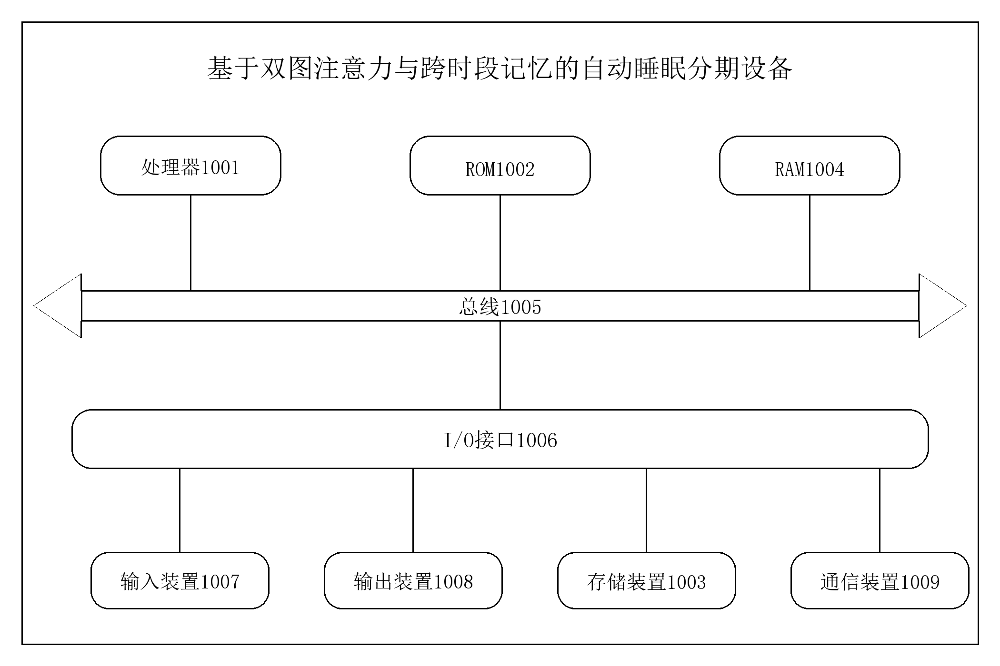

# SleepGAT：基于双图注意力与跨时段记忆的自动睡眠分期

SleepGAT 联合建模 EEG、EOG 信号的局部波形节律、通道功能连接、睡眠阶段转移先验及跨 epoch 上下文，输出中心 epoch 的 W、N1、N2、N3、REM 五类睡眠阶段。初稿附图中亦称该网络为 **MC-TRSleepGAT**。

本 README 的方法、模型结构及实验数值依据仓库中的[《睡眠自动分期初稿》Word 原文](睡眠自动分期初稿.docx)整理，对应专利题名“基于双图注意力与跨时段记忆的自动睡眠分期方法、装置、设备及存储介质”。图2至图7均直接从该 Word 提取，未重新绘制或替换数值。

**结果来源说明：**下面的性能与消融结果为初稿报告值。本次仓库整理未重新训练模型；现有 `SleepGAT/train_EDF20_LOGO.py` 为 SC412、SC417 调试版本，不能直接视为初稿20名受试者实验的完整复现。代码与初稿的具体差异见[复现边界](#复现边界与科研方法风险)。

## 项目结构

```text
.
├── README.md
├── requirements.txt                 # 直接依赖清单，非原实验版本锁定文件
├── 睡眠自动分期初稿.docx              # README 的权威内容来源，保留原文件
├── SleepGAT/
│   ├── model.py                     # 残差TCN、MCGAT、TRGAT、门控融合及BiLSTM
│   ├── SleepEDFdataset.py           # EDF读取、预处理、先验图与中心上下文窗口
│   └── train_EDF20_LOGO.py          # 当前调试训练入口
├── model/                          # 目标仓库原有训练代码，保留作历史版本
├── docs/patent/figures/             # 初稿图2至图7的原始PNG
├── docs/superpowers/                # 已有绘图设计及实施记录
├── plot_cn_patent.py                # 固定指标数据的中文绘图工具
├── plot_confusion_matrix_cn_patent.py # 固定混淆矩阵的中文绘图工具
└── tests/                          # 现有绘图测试
```

当前说明对应 `SleepGAT/`；`model/` 是远端仓库原有版本，两者不能混用来解释初稿结果。原始 EDF 数据、模型权重、运行日志和缓存不纳入 Git。

## 数据与预处理

初稿实施例采用 Sleep-EDF-20，描述为 Sleep-EDF Expanded 数据库 Sleep Cassette 子集中的20名健康受试者整夜记录，10名男性、10名女性，年龄25至34岁，配有逐 epoch 人工睡眠阶段标注。

| 项目 | 初稿实施例设置 |
| --- | --- |
| 通道及顺序 | `EEG Fpz-Cz`、`EEG Pz-Oz`、`EOG horizontal` |
| 采样率 | 100 Hz |
| epoch 长度 | 30秒，即每通道3000采样点 |
| 标签顺序 | W、N1、N2、N3、REM；代码编号0至4，原始阶段3和4合并为N3 |
| EEG 滤波 | 0.5–35 Hz 带通 |
| EOG 滤波 | 0.3–10 Hz 带通 |
| 标准化 | 受试者级、逐通道零均值单位方差处理 |
| 上下文 | 半径 `r=3`，长度 `S=7`，覆盖210秒 |
| 窗口边界 | 片段首尾索引裁剪，重复边界 epoch；不跨记录或未知标签区间 |
| 预测对象 | 每个窗口的中心 epoch |
| 评估方式 | 初稿说明采用留一受试者交叉验证，阶段转移先验仅由训练标签统计 |

相邻中心窗口步进一个 epoch，内部共享6个 epoch；每个 epoch 本身为30秒固定片段。代码保留睡眠开始前及结束后各最多60个 epoch 的清醒片段，并在未知标签处切断序列。当前读取器不执行重采样，输入数据须与配置的100 Hz匹配。

## 方法流程与模型结构

### 图1：S10–S90 方法流程

初稿图1以 Word 原生形状保存。下面依据正文步骤展示流程；原始图1及摘要附图可在 Word 原文查看。



S70与S80对应共享TCN特征的两条图分支，随后在S90融合。

### 图2：MC-TRSleepGAT 网络架构



1. **Enhanced ResTCN**：三层残差一维时序卷积块，包含卷积、批归一化、ReLU、Dropout与残差连接；首个卷积的扩张因子依次为1、2、4。自适应平均池化及全连接映射得到每通道128维局部时序特征。
2. **MCGAT 多通道图注意力**：通道为节点，功能连接矩阵为 `A_fc[i,j] = abs(corr(x_i,x_j))`。将功能连接强度的对数先验加入可学习注意力打分，再进行多头聚合、残差归一化与可学习通道汇聚。
3. **TRGAT 睡眠阶段关系图注意力**：设置五个可学习阶段节点 `U`，按训练受试者的转移矩阵传播得到 `Ũ = P U`；利用当前 epoch 的通道平均特征与阶段节点计算缩放点积注意力，经残差及层归一化生成阶段关系表示。
4. **门控融合**：`z = sigmoid(W[m || t] + b)`，`f = z ⊙ m + (1 − z) ⊙ t`，逐维调节两条图分支的贡献。
5. **跨时段记忆及分类**：连续7个 epoch 的融合特征输入 BiLSTM，经全连接层产生五类 logits，取中心位置作为训练和推理输出。

阶段转移矩阵按训练集中每个连续片段的相邻标签统计并按行归一化，不能跨记录连接标签，也不能用验证或测试受试者标签构建该先验。

### 张量数据流

`B` 为批量大小，`S` 为上下文长度，`C` 为通道数，`L` 为每个 epoch 的采样点数。以下为当前 `SleepGATNet` 默认参数下的实现形状。

| 环节 | 张量形状 |
| --- | --- |
| 输入 | `[B, 7, 3, 3000]`，浮点信号 |
| 通道功能连接 | `[B, 3, 3]`，也支持逐epoch的 `[B, 7, 3, 3]` |
| 阶段转移先验 | `[5, 5]` |
| TCN通道特征 | `[B×7, 3, 128]` |
| MCGAT输出 | `[B×7, 256]`，4个注意力头 |
| TRGAT输出 | `[B×7, 256]`，阶段节点为 `[5, 256]` |
| 融合及BiLSTM输入 | `[B, 7, 256]` |
| BiLSTM输出 | `[B, 7, 256]`，每方向隐藏维度128 |
| 分类器输出 | `[B, 7, 5]` logits；中心输出为 `logits[:, 3, :]` |
| 辅助阶段匹配得分 | `[B×7, 5]`；当前训练入口未使用辅助损失 |

初稿在部分图表示中采用128维的实施例描述；当前实现由128维TCN特征投影至256维图表示。上述表格明确记录代码配置，不将该差异改写成初稿原始设置。

## 初稿验证结果

### 图3：整体性能



初稿正文报告20名受试者整体测试结果：

| 指标 | 初稿报告值 |
| --- | ---: |
| Accuracy | 85.34% |
| Macro-F1 | 83.37% |
| Cohen’s Kappa | 80.47%，即κ=0.8047 |

图3保留原稿误差棒。绘图脚本固定误差值为1.20、1.80、1.50，但初稿未明确误差棒是否表示折间标准差、标准误或置信区间，亦未提供逐折原始结果，因此不将其解释为已经核实的统计误差。

### 图4：混淆矩阵与阶段识别率



行为真实阶段、列为预测阶段，数值为按真实类别归一化的百分比。对角线对应各阶段的召回率，不是每类精确率。

| 真实\预测 | W | N1 | N2 | N3 | REM |
| --- | ---: | ---: | ---: | ---: | ---: |
| W | 89.82 | 7.23 | 1.03 | 0.24 | 1.68 |
| N1 | 10.07 | 61.57 | 16.30 | 0.50 | 11.55 |
| N2 | 0.64 | 3.67 | 87.53 | 4.52 | 3.64 |
| N3 | 0.11 | 0.16 | 11.12 | 88.62 | 0.00 |
| REM | 1.30 | 3.73 | 4.60 | 0.04 | 90.33 |

初稿中W、N2、N3、REM阶段识别率分别为89.82%、87.53%、88.62%、90.33%；N1为61.57%，主要误分至N2（16.30%）、REM（11.55%）及W（10.07%）。N3误分至N2为11.12%。这里保留原始两位小数，行和可能因舍入略偏离100%。

### 图5：消融实验



以下逐项转录初稿图5；κ沿用原稿的百分比展示方式。

| 模型变体 | Accuracy | Macro-F1 | Cohen’s Kappa |
| --- | ---: | ---: | ---: |
| SleepGAT完整模型 | 85.34% | 83.37% | 80.47% |
| 去除MCGAT模块 | 83.52% | 81.06% | 78.14% |
| 去除TRGAT模块 | 83.89% | 81.44% | 78.66% |
| 去除BiLSTM模块 | 82.41% | 79.68% | 76.62% |
| 去除Focal Loss | 84.63% | 81.77% | 79.45% |
| 仅保留Enhanced ResTCN | 80.96% | 77.83% | 74.85% |

按初稿报告值，移除MCGAT、TRGAT、BiLSTM及Focal Loss后，准确率分别下降1.82、1.45、2.93及0.71个百分点；仅TCN相较完整模型下降4.38个百分点。这些比较是对初稿数值的整理，仓库未附六组实验的原始预测、完整运行日志或独立消融入口。

初稿未报告逐受试者结果、各折均值与标准差、每类precision/F1、specificity、AUROC或AUPRC。本 README 不补造缺失指标，也不将总体窗口分类结果称为患者级诊断指标。

## 装置与设备实施例

### 图6：自动睡眠分期装置



初稿实施例二包含信号预处理模块10、上下文窗口构造模块20、先验图构建模块30、时序卷积特征提取模块40、多通道图注意力模块50、阶段关系图注意力模块60、门控融合模块70和跨时段分类模块80，对应上述方法的数据处理与网络计算过程。

### 图7：设备与存储介质



初稿实施例三给出处理器1001、ROM1002、存储装置1003、RAM1004、总线1005、输入/输出接口1006、输入装置1007、输出装置1008与通信装置1009。程序由处理器执行上述睡眠分期步骤，亦可存储于计算机可读存储介质。该图为专利设备结构示例，仓库未实现对应硬件产品。

## 安装与使用

### 环境安装

建议使用独立Python环境。`requirements.txt` 根据代码导入整理，未锁定初稿训练环境；Python、PyTorch、CUDA及各依赖的原始版本尚未提供。

```bash
git clone https://github.com/123090262/Sl.git
cd Sl
python -m venv .venv
python -m pip install -r requirements.txt
```

安装前先激活虚拟环境：Windows PowerShell 使用 `.\.venv\Scripts\Activate.ps1`；Linux/macOS 使用 `source .venv/bin/activate`。GPU运行需安装与本机CUDA环境匹配的PyTorch。

### 数据准备

在本地准备Sleep-EDF-20的 `*-PSG.edf` 和匹配的 `*-Hypnogram.edf`，放置于同一目录。读取器按受试者编号前5字符分组，取PSG文件前6字符匹配标注文件。请核对通道顺序、采样率及每份记录的标注配对；EDF文件不随仓库分发。

### 当前调试训练入口

以下从命令中覆盖数据路径及输出目录，无需沿用脚本内的本机绝对路径：

```bash
cd SleepGAT
python -c "from train_EDF20_LOGO import CONFIG, train_loso; CONFIG.update(dataset_root='../data/SleepEDF-20', save_dir='../outputs/debug_412_417/checkpoints', log_dir='../outputs/debug_412_417/runs'); train_loso()"
```

替换 `dataset_root` 为真实目录，每次运行另设唯一输出目录以免覆盖。该入口从排序后的前20个受试者中仅选择包含412或417的编号作为测试对象，训练中心epoch；生成checkpoint、训练损失曲线、混淆矩阵及控制台结果。它使用测试对象早停，**仅适合调试，不可直接用于报告无偏测试性能**。

| 配置 | 初稿训练示例 | 当前调试代码 |
| --- | --- | --- |
| 优化器 | Adam或AdamW | AdamW |
| 初始学习率 | `1e-3` | `2e-4` |
| 权重衰减 | `1e-4` | `5e-4` |
| batch size | 32 | 64 |
| epoch上限 | 未明确 | 60 |
| 早停耐心 | 未明确 | 20 |
| Focal聚焦系数 | 2 | 2 |
| 类别权重 | 可由训练类别计数确定 | `[0.6, 4.0, 0.6, 1.0, 1.0]` |
| 上下文长度 | 7 | 7 |

### 绘图与现有测试

在仓库根目录执行：

```bash
python plot_cn_patent.py
python plot_confusion_matrix_cn_patent.py
python -m pytest tests -q
```

绘图输出至 `outputs/figures/`，包含PNG和SVG。这两个工具使用固定的指标及混淆矩阵，不能用于从模型预测重新计算指标；README展示的是初稿内嵌原图。现有测试验证图表输出及关键绘图数据，不能证明模型达到初稿指标。

## 复现边界与科研方法风险

1. **测试集参与模型选择。** 当前调试入口每轮在测试受试者上计算准确率并选择最佳checkpoint。正式留一受试者评估需在训练受试者内独立划分验证集，完成早停和超参数选择后仅一次评估外层测试受试者。
2. **受试者级统计量使用范围。** 当前数据加载器在划分前对各受试者全部有效记录拟合标准化，并计算该受试者的通道相关矩阵，包含测试对象全记录的无标签信号；睡眠范围裁剪和有效片段划分还使用人工标注。该流程不能直接称为仅训练数据拟合的归纳式评估或无标注在线推理。正式实验应明确离线协议，并核对初稿“有效训练片段”描述与实际实现。
3. **阶段转移先验。** 当前训练入口对每一折使用 `get_transition_matrix(data_dict, train_subs)`，排除测试标签；不要改用加载器同时返回的全体受试者 `P_matrix`。
4. **非因果上下文。** 7个epoch中心窗口使用未来3个epoch，BiLSTM和双向滤波均面向离线处理；不能据此宣称实时零延迟分期。
5. **损失实现差异。** 初稿公式为 `−α_y(1−p_y)^γ log(p_y)`；代码从已加权交叉熵计算 `pt=exp(−ce_loss)`，调制因子中的概率受类别权重影响，与该公式不完全相同。
6. **实验记录不完整。** 当前入口未统一设置随机种子；checkpoint只保存模型权重，未完整保存优化器、配置、环境版本及逐折预测。初稿指标与图3误差棒仍需完整实验记录核验。
7. **评估指标尚未完整对应。** 当前入口输出受试者Accuracy、Macro-F1、Kappa和总体混淆矩阵，但未保存各折完整指标汇总及均值、标准差；归一化混淆矩阵没有类别样本计数，不能单独用来复算整体Accuracy或Macro-F1。

本次整理保留模型、数据处理及训练行为，未以文档修改替代训练协议修正。完整复现初稿需要补齐正式验证划分、统计量拟合协议、环境锁定、种子与六组消融实验记录。
